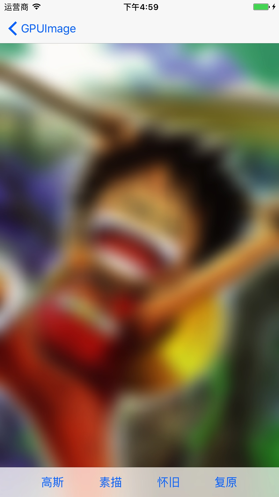

#GPUImage之给图片添加滤镜

### 相关类:
* `GPUImagePicture`作为PGUImage的图像处理类,一般用来处理源图像.
* `GPUImageFilter`是各种滤镜的基类,GPUImage所内置的100多种滤镜效果都继承于此类.

### 高斯模糊的实现
```
// 创建用于处理单张图片的GPUImagePicture
let processView = GPUImagePicture(image: image)

// 创建高斯模糊滤镜
let blurFilter = GPUImageGaussianBlurFilter()
blurFilter.blurRadiusInPixels = 20

processView?.addTarget(blurFilter)

// 处理图像
blurFilter.useNextFrameForImageCapture()
processView?.processImage()

 // 获取处理过后的图像
imageView.image =  blurFilter.imageFromCurrentFramebuffer()
```

